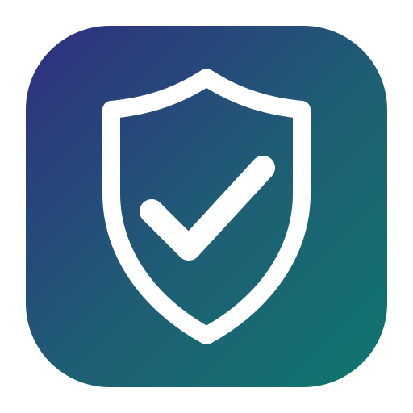

<p align="center">
  
</p>

<h1 align="center">Selest reCAPTCHA</h1>

<p align="center">Google reCAPTCHA pour les formulaires PrestaShop qui reçoivent le plus de spam.</p>

<p align="center">
  
  
  
</p>

---

Le spam n'arrive pas par la boutique, il arrive par les formulaires : le
formulaire de contact, la création de compte, le bloc newsletter, les avis
produits. Ce module pose le reCAPTCHA de Google sur ces quatre formulaires, et
**vérifie chaque jeton côté serveur avant que la boutique ne traite la
soumission**. Un jeton absent ou refusé, et le gestionnaire natif ne voit jamais
le POST.

### Le formulaire de contact, protégé


*Capture réalisée sur une boutique de test avec les clés de test officielles de
Google — d'où la bannière rouge « for testing purposes only » que Google y
ajoute.*

### Le back-office


*(Capture sur une boutique dont le back-office est en anglais ; le module suit la
langue de la boutique — en français, le même écran affiche « Protéger les
formulaires de la boutique », « Tester les clés », « Enregistrer »…)*

Tout tient sur un seul écran : les versions à protéger, un interrupteur par
formulaire, le score minimum, ce qui se passe quand Google est injoignable, et
les messages affichés au visiteur. Le bouton **Tester les clés** appelle Google
depuis le serveur et indique si la paire fonctionne, est refusée, ou est
simplement injoignable.


---

## Ce que fait le module

- **Trois versions** : reCAPTCHA v2 avec case à cocher, v2 invisible, et v3
  (invisible, avec score). Pour la v3, le module contrôle en plus le **score**,
  l'**action** et, en option, le **nom de domaine** que Google renvoie.
- **Quatre formulaires protégés**, chacun avec son interrupteur, son nom
  d'action et son score minimum : contact, création de compte, newsletter, avis
  produits.
- **Une soumission refusée ne produit aucun effet de bord.** Le module retire
  les champs déclencheurs (`contactform`, `ps_emailsubscription`,
  `productcomments`…) avant que le code natif ne s'exécute : rien n'est
  enregistré, aucun compte n'est créé, aucun e-mail n'est envoyé. Ce que le
  visiteur a tapé est conservé.
- **Anti-rejeu.** Un jeton n'est accepté qu'une fois, exactement comme Google
  le fait lui-même.
- **Modes d'échec explicites.** Un jeton absent ou un refus de Google est
  toujours un refus, quel que soit votre réglage. « Accepter quand Google est
  injoignable » ne concerne que les pannes réseau : c'est un choix commercial,
  pas un détail technique, donc un interrupteur — et l'avertissement est juste
  au-dessus.
- **Compatible multistore** : une ligne de configuration par boutique.
- **Interface en français et en anglais** : le back-office suit la langue de la
  boutique, et les messages affichés aux visiteurs sont traduits à
  l'installation.
- **RGPD** : le module s'enregistre sur le hook `registerGDPRConsent`, donc un
  gestionnaire de consentement peut empêcher le widget de se charger.
- **Sans Composer, sans build.** Le module embarque son propre autoloader
  PSR-4.
- **Compte les installations, si vous le voulez.** Un unique message anonyme par
  installation et par mise à jour — versions du module et de la boutique, langue.
  Ni nom de boutique, ni adresse, ni e-mail, ni donnée client. Désactivé par
  défaut, avec le contenu exact du message écrit sous l'interrupteur.
- **Détecte un autre module reCAPTCHA** installé sur la boutique et prévient dans
  le back-office : deux captchas sur le même formulaire ne protègent à rien.

## Prérequis

- PrestaShop **8.2 LTS** ou **9.x** (développé et testé sur 8.2.8 et 9.2.0)
- PHP 8.1+
- Une paire de clés reCAPTCHA créée sur <https://www.google.com/recaptcha/admin>

## Installation

Téléchargez le zip depuis la page [Releases](../../releases), puis dans
PrestaShop : **Modules → Ajouter un nouveau module → Importer un module**, et
installez et configurez le module.

En ligne de commande :

```bash
unzip selestrecaptcha.zip -d modules/
php modules/selestrecaptcha/tools/install-module.php
```

Ou directement depuis GitHub :

```bash
git clone https://github.com/fred-selest/ps-selestrecaptcha.git modules/selestrecaptcha
php modules/selestrecaptcha/tools/install-module.php
```

## Configuration

1. Créez une paire de clés pour votre domaine dans la console reCAPTCHA, puis
   collez la **clé du site** et la **clé secrète**. **Tester les clés** vous dit
   immédiatement si la paire est acceptée.
2. Choisissez une version. Commencez par la v2 avec case à cocher si vous
   n'êtes pas sûr : c'est celle qui fonctionne partout et la moins susceptible
   de surprendre vos clients.
3. Laissez **Refuser la soumission** comme réponse à « quand Google est
   injoignable ». Vous perdez le client occasionnel pendant une panne de Google,
   vous ne perdez jamais un spam. Ne changez que si une commande perdue vous
   coûte plus qu'un message perdu.
4. En v3, laissez le seuil à `0.5` jusqu'à avoir du trafic réel, puis surveillez
   le canal de log `selestrecaptcha` et ajustez.

La clé secrète n'est jamais renvoyée au navigateur, et un champ secret laissé
vide à l'enregistrement signifie « garder la clé enregistrée ».

## Vie privée

Google reçoit l'adresse IP du visiteur et l'URL de la page quand le widget
s'affiche. Dites-le dans votre politique de confidentialité : les
[conditions de traitement de Google](https://policies.google.com/terms)
s'appliquent. Avec **Journaliser chaque décision** activé, l'IP du visiteur est
écrite dans le canal PrestaShop `selestrecaptcha` ; les jetons et les clés
secrètes ne sont jamais journalisés.

## Activer la CI et la release (une fois pour toutes)

Les deux fichiers de workflow sont dans [`tools/github-actions/`](tools/github-actions/) :

| Fichier | Ce qu'il fait |
|---|---|
| `tests.yml` | lance PHPUnit sur PHP 8.1, 8.2 et 8.3 à chaque push |
| `release.yml` | construit le ZIP et publie la GitHub release dès qu'un tag est poussé |

Pour les activer : copier chaque fichier dans `.github/workflows/` du dépôt
(*Add file → Create new file*), puis pousser un tag :

```bash
git tag v1.0.0 && git push --follow-tags
```

Le ZIP des merchants est toujours construit depuis un commit exact.

## Tests

```bash
composer install
./vendor/bin/phpunit
```

End-to-end contre une vraie boutique, avec un faux du point de vérification de
Google :

```bash
php tests/e2e/e2e.php http://127.0.0.1 /chemin/vers/prestashop ps828
```

Page de back-office, aller-retour d'enregistrement et test des clés :

```bash
php modules/selestrecaptcha/tools/render-admin.php --save --test
```

Le JavaScript est testé dans un vrai navigateur (Chromium via Playwright),
parce que le widget est précisément ce qu'un test HTTP n'exécute jamais :

```bash
pip install playwright && playwright install chromium
python tests/e2e/browser.py http://127.0.0.1 /chemin/vers/prestashop
```

## Statistiques d'installation

Par défaut, **rien n'est envoyé**. Si vous activez l'option, un message part une
seule fois à l'installation et une fois à chaque mise à jour :

```
event=install&module=selestrecaptcha&module_version=1.0.0
&prestashop_version=9.2.0&php_version=8.2.34&locale=fr-FR&protected_forms=4
```

Le point de collecte est le vôtre (HTTPS, ou loopback). Le bouton **Envoyer
maintenant** envoie le message depuis le back-office pour que vous voyiez ce qui
part. Une collecte qui échoue n'interrompt jamais l'installation.

## À savoir

- Le point de vérification est configurable, pour les boutiques derrière un
  pare-feu qui veulent pointer vers un proxy local. Le HTTP simple n'est accepté
  que pour les adresses de loopback ; tout le reste doit être en HTTPS.
- Ce n'est ni un limiteur de débit ni un pare-feu. Complétez-le par l'un des deux
  si vous subissez une véritable attaque.

## Support

Problèmes et idées : <https://github.com/fred-selest/ps-selestrecaptcha/issues>

## Licence

AFL-3.0 — voir [LICENSE](LICENSE).